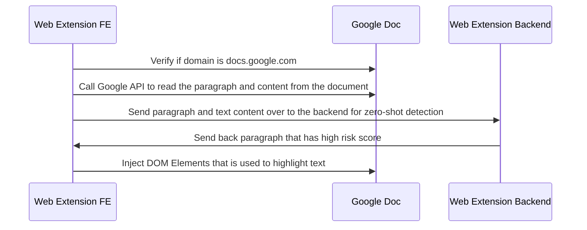

```mermaid
sequenceDiagram
Web Extension FE->>Google Doc: Verify if domain is docs.google.com
Web Extension FE->>Google Doc: Call Google API to read the paragraph and content from the document
Web Extension FE->>Web Extension Backend: Send paragraph and text content over to the backend for zero-shot detection
Web Extension Backend->>Web Extension FE: Send back paragraph that has high risk score
Web Extension FE->>Google Doc: Inject DOM Elements that is used to highlight text
```
